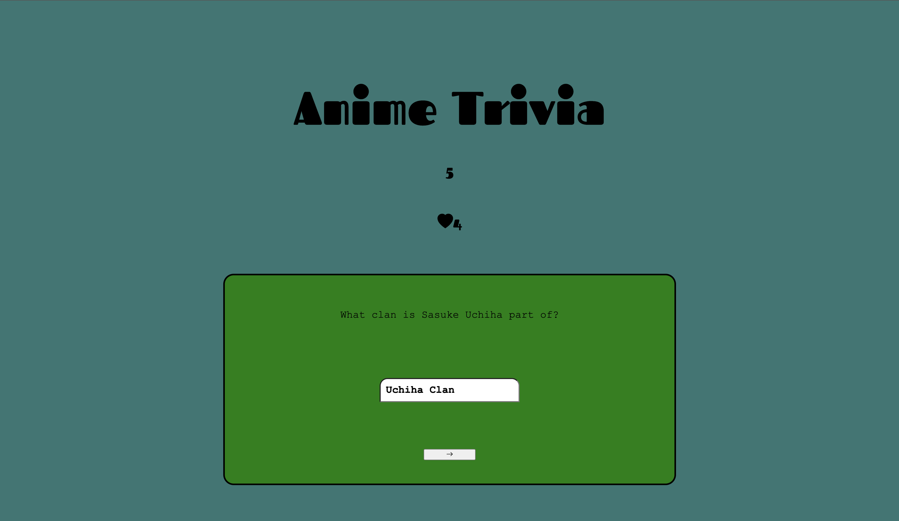
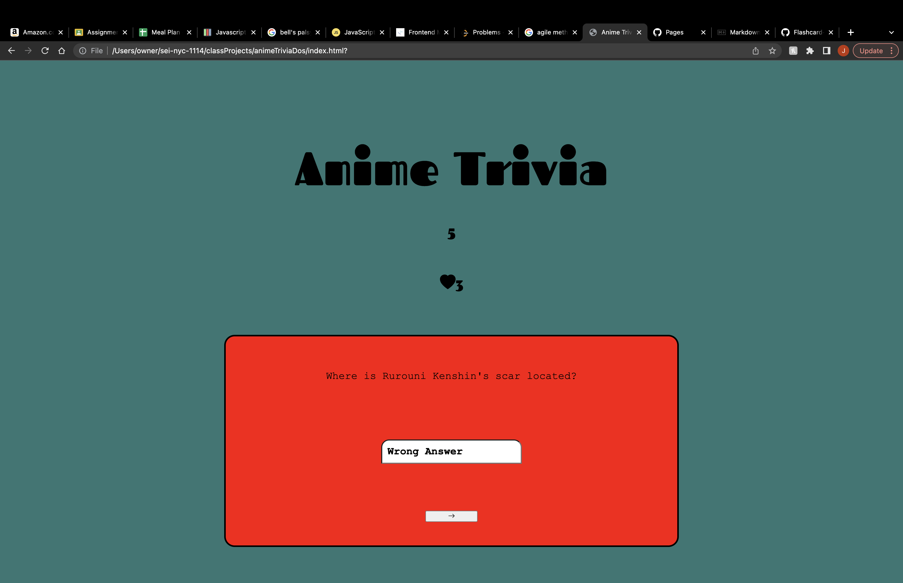

# Project 1
#AnimeTrivia
---
###Description
---
Live Demo:https://howzaycalderon.github.io/Project_1/

This is a front-end game application developed as my first project while studying at General Assembly.

This is a Trivia Game that tests a person's knowledge of a varierty of Anime shows. As users work through the game and answer questions correctly they will receive points and eventually win. If more than 3 questions are answered incorrectly the player loses. 

###Technologies Used
---
- Front-end: HTML, CSS, Vanilla Javascript
###Future Features:
---
I would like to revisit this app and...

- Add more questions to the game
- Switch from input to multiple choice options
- Add a button that resets the entire game
- Randomize the order of the questions each time its loaded
